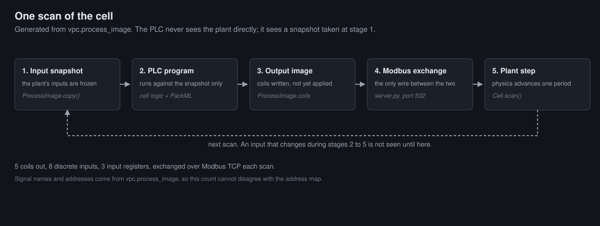
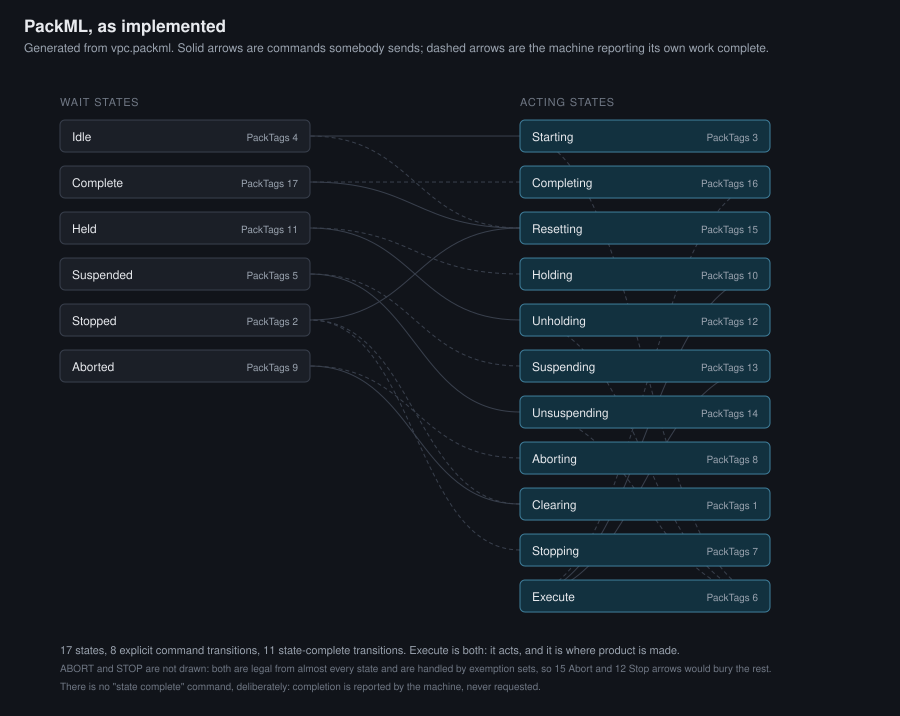
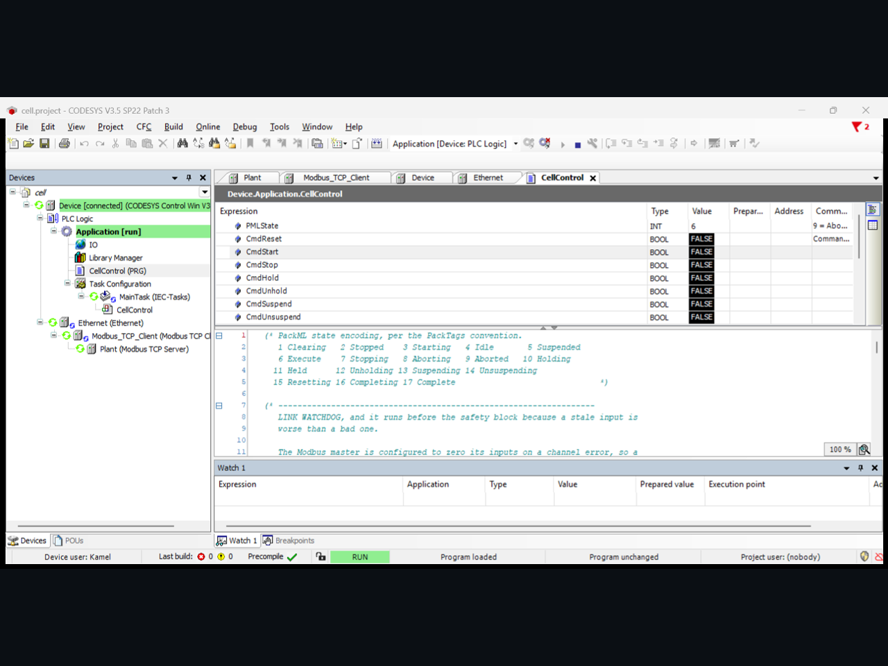
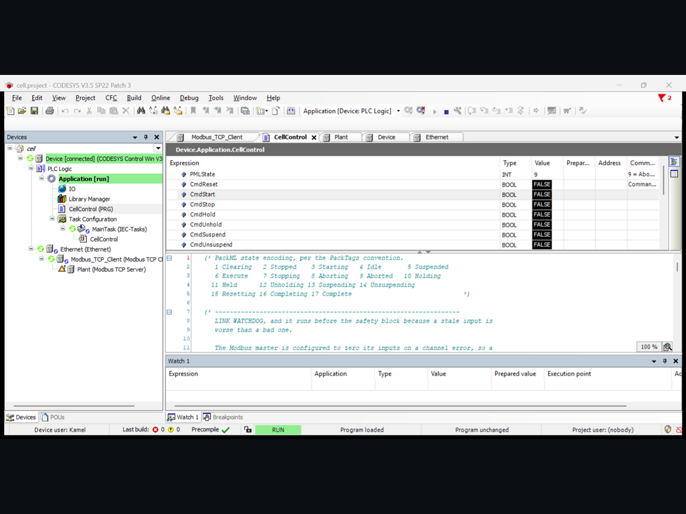
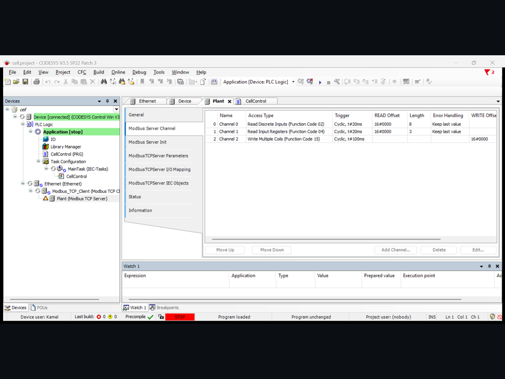
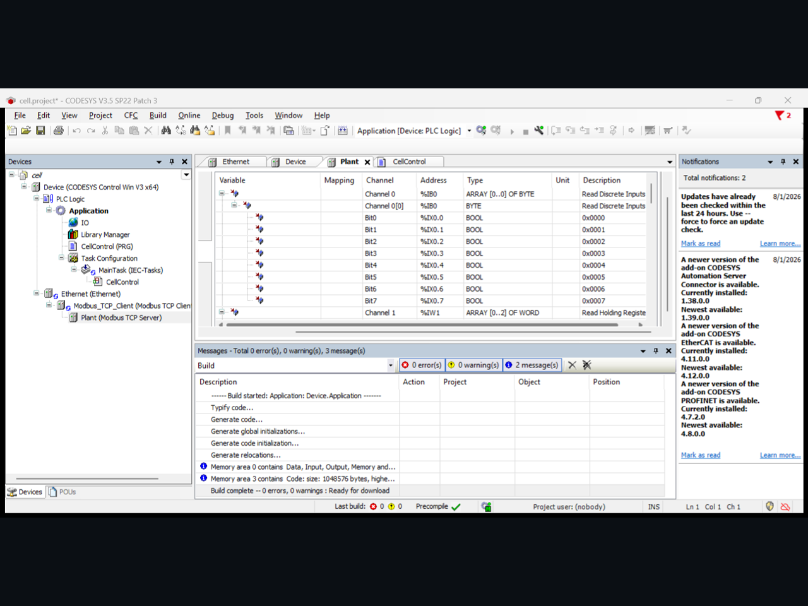

# Virtual production cell

A packaging cell simulated in enough detail to run **real IEC 61131-3 control
against it**, which is what virtual commissioning means: the PLC program is the
thing under test, and the plant is a model it drives.

**It has been run.** The Structured Text is compiled and executed on a CODESYS
SoftPLC, driving the plant live over Modbus TCP, and the safety behaviour was
forced by hand rather than argued for. Screenshots of the running cell are
below. This README describes what exists, not what is planned.

| | |
|---|---|
| **299** | tests, 100% statement **and** branch coverage, gated in CI |
| **5 → 14 → 28** | hazards to requirements to the tests that verify them, gated in both directions |
| **62.5%** | baseline OEE, against 55.0% with a guard interruption and 46.5% with a starved infeed |

## Architecture

```
PLC program, Structured Text          the thing under test
   |  process image over Modbus TCP
   v
plant simulation, Python              deterministic, exhaustively tested
   |
   +-- OPC UA server                  supervisory interface
   |     +-- PackTags                 the machine's own view of itself
   |     +-- ISA-95 hierarchy         where the machine SITS, and its KPIs
   +-- safety channel                 imports the protection layer from P2
```

The split matters. The PLC runs on a vendor runtime under Windows; everything
below it is Python and runs anywhere. That is also how a real virtual
commissioning rig is arranged, with the controller on its own runtime and the
plant model elsewhere.

**Picking this up after a break, or on Windows? Start with
[`docs/RESUME_HERE.md`](docs/RESUME_HERE.md).**

### One scan, which is the part prose is worst at



The PLC never sees the plant. It sees a **snapshot** taken at the scan
boundary, so an input that changes during stages 2 to 5 is not an input change
until the next stage 1. That single property is what makes the timing
deterministic and reproducible, and it is the thing a reader most often skims
past in a paragraph.

### PackML, as implemented rather than as specified



Seventeen states and two different kinds of transition. **Solid arrows are
commands somebody sends; dashed arrows are the machine reporting its own work
complete.** Conflating the two is the usual way to get PackML wrong, and there
is deliberately no "state complete" command anywhere in `vpc.packml`.

Both diagrams are **generated from the code they describe**, by
`scripts/render_diagrams.py`, and CI redraws them and fails on a diff. That is
the same rule the traceability matrix already lives under, for a stronger
reason: a stale number in a README at least gets read, while nobody diffs a
picture, so a diagram that quietly stopped matching the state machine would go
on looking authoritative indefinitely. Tracing the diagram from the standard
instead would have produced a picture of the standard, which proves nothing
about this code.

## Running on a CODESYS runtime, which is the part that had to be proven

The controller needs a vendor runtime and those are Windows only to author, so
the project splits: plant, state model and tests are developed and verified on
Linux, the controller runs on Windows. That is how a virtual commissioning rig
is normally arranged anyway. `docs/WINDOWS_SETUP.md` is the sequence that was
followed, and `plc/codesys/cell.project` is **generated** by
`plc/codesys/build_project.py` driving the CODESYS scripting engine, so the
project file is reproducible rather than a hand-built artefact nobody can rebuild.



*PackML state 6, Execute. The program is on the SoftPLC and the plant is being
driven over Modbus TCP.*



*The same cell moments after the plant process was killed. The heartbeat stopped
advancing, the link watchdog fired, PackML went to state 9 Aborted and every
actuator dropped. **SR-06 and SR-07 forced by hand, not argued for.***



*The Modbus client channels, each cyclic at 20 ms against the plant's 50 ms
scan, so the controller never reads a half-updated image.*



*The process image mapped bit by bit onto the PLC's variables. The address map
is generated from one enum in `src/vpc/process_image.py`, so the two halves
cannot disagree.*

## What exists

**`src/vpc/packml.py`** implements the PackML state model from ISA-TR88.00.02:
seventeen states, the acting and wait distinction, and the state complete
transition that belongs to the machine rather than to any operator.

It is in Python **first, deliberately.** PackML belongs in the PLC and is
written in Structured Text, but that ST could not be executed on the Linux
machine the model was developed on, and a seventeen state machine with a partial
transition function is exactly the kind of thing that looks correct and is not.
So the model was built and verified here, exhaustively, and the ST was written
to match it. This module is the executable specification; the ST is an
implementation of it, and `tests/test_st_matches_the_model.py` parses the ST and
checks that it still is. That test earned itself on its first run: the program
declared its power on state as `4` with a comment saying Aborted, and 4 is Idle.
**A controller powering up Idle is one command away from running a machine
nobody has reset.**

The tests enumerate rather than sample:

- every state is reachable from power on, by breadth first search over commands
  and state complete, not by walking paths the author had in mind
- **Execute is reachable from every state**, so the cell can never enter
  something it cannot productively leave
- **Abort is reachable from every state** that is not already going there, since
  a safety path one state cannot reach is not a safety path
- every one of the 17 x 9 state and command combinations either transitions or
  raises, so a command an operator believed was accepted is never silently
  swallowed
- Abort outranks Stop, checked because transposing them means a machine that
  politely decelerates when somebody hit the emergency button

**`src/vpc/process_image.py`** is the contract between the two halves: the
address map, held once, from which the PLC side declarations are generated. Two
copies of an address map is one copy plus a future defect.

It also carries the reason the whole thing is scan based rather than event
driven. A real PLC copies every input into a buffer, runs the program against
that frozen snapshot, then writes every output at once, so a signal that changes
twice in a scan is seen once and nothing the program writes takes effect until
the scan ends. Those are the semantics people get wrong moving from software to
control, and a callback based simulation would hide them.

**`src/vpc/cell.py`** is the plant: a conveyor with a filler, a capper and a QC
reject, advanced one scan at a time and never by a clock. Deterministic, so a
scenario replays exactly. The one part modelled carefully is the safety chain,
because it is the part with a wrong answer that hurts somebody: torque is the
safety channel's to give, not the program's to take, and closing a guard does
not by itself restore it.

**`plc/cell_control.st`** is the program under test, written to plain IEC 61131-3.
`tests/test_st_matches_the_model.py` parses it and checks its transition table
against the verified Python model, because the ST cannot be executed here. That
test earned itself immediately: the program declared its power on state as 4,
with a comment saying Aborted, and 4 is Idle. A controller powering up Idle is
one command away from running a machine nobody reset.

**`src/vpc/modbus.py`** is Modbus TCP, implemented rather than imported. Every
function in it goes from bytes to bytes with no socket anywhere, which is what
makes the wiring layer exhaustively testable: every function code, every
exception path, every boundary, every malformed frame, and every split point of
a frame arriving one byte at a time. Modbus TCP is small, and a dependency whose
API moves between minor versions is a worse bet than 200 lines that do not.

**`src/vpc/server.py`** is the bridge, and it is the reason everything above is
shaped the way it is. The PLC is the client and the plant is the server, which
is not arbitrary: the PLC writes coils and reads discrete inputs and input
registers, and those directions are what the Modbus address spaces mean. To a
controller this simulation is a remote IO drop that happens to think.

It runs in **one thread**, on a selector whose timeout expires at the next scan
boundary. A socket thread plus a scan thread plus a lock would fix the race and
still be wrong, because a lock lets a coil write land in the *middle* of a scan
and the entire point of a process image is that it cannot. So network writes
land in a staged image that the plant sees only at the boundary:

> A controller that sets `CONVEYOR_RUN` and takes it back within one scan period
> has, from the plant's point of view, done nothing at all.

That is what happens on a real machine, and it is a class of bug a callback
simulation makes invisible. `tests/test_server.py` pins it, along with the
control case, because a boundary test passes trivially on a server that ignores
writes entirely.

Verified against **pymodbus** as well as its own tests, since a server checked
only by the client that shares its assumptions proves self-consistency rather
than a wire format.

## The information model, which is the part PackTags cannot do

PackTags answers *what is this machine doing*. It does not answer *which
machine*, and on a real site that is the harder question. A flat address space
works for exactly one machine; the second arrives with a `StateCurrent` of its
own, the two collide, and every supervisor above them grows a per-machine
translation layer, which is the thing PackTags existed to remove.

`src/vpc/isa95.py` makes the equipment address structural, so a work unit is
identified by where it sits:

```
Enterprise/Site/Packaging/BottlingLine1/PackagingCell
                                        +-- Infeed      Filler    Capper
                                        +-- QCStation   Outfeed
```

Browse to that path over OPC UA and the work unit carries `MachineState`,
`UnitMode`, `StopReason`, the counts, the ISO 22400 KPIs (availability,
performance, quality, OEE), a measured `CycleTime`, the recipe and the active
alarm count. `tests/test_opcua_isa95.py` walks that path **by name at every
level** with a real `asyncua` client over the encrypted channel, because being
handed the node would let a broken hierarchy pass.

Three things are deliberate and worth arguing with:

- **The levels are IEC 62264-1**, which defines Enterprise, Site, Area, Work
  Center and Work Unit. "Production Line" and "Work Cell" are specialisations of
  the last two, not levels. `EquipmentModule` is **ISA-88**, borrowed on purpose
  and labelled as such, because the filler and the capper are real addressable
  things and pretending otherwise would be a worse model than crossing a
  standard boundary and saying so.
- **OEE is ISO 22400, not ISA-95.** It is routinely called an ISA-95 KPI and is
  not one. ISA-95 gives the hierarchy the KPIs hang on.
- **Only the work unit carries variables.** A Site has no `MachineState`, and
  inventing one invites a supervisor to aggregate across a level that never
  populated it.

Two smaller decisions that a supervisor would otherwise trip on: a line that
produced nothing publishes `CycleTime` of **-1.0** rather than 0.0, because OPC
UA has no null for a Double and zero trends as an infinitely fast line; and
nothing in the set is writable, because a supervisor able to set OEE could
report a line healthy that is not.

The hierarchy is not decoration. A supervisor written against this address space
works unchanged against a site with four lines, which is the claim the flat tag
list could not make.

## What it does when the link dies, which is the result worth having

Demonstrated on the running cell, not argued from the model. With the controller
producing, the plant process was killed:

```
PMLState      6 Execute  ->  9 Aborted
every coil    FALSE
Plant device  fault
```

Then the plant was restarted, and **nothing was touched in the IDE**:

```
master reconnected    127.0.0.1 -> 502  Established
SCAN_COUNT   488 -> 548                 the plant is alive again
PRODUCED     0 -> 0                     the machine is not
```

> The cell recovers the **connection** automatically and refuses to recover the
> **machine** automatically.

Both halves are deliberate. A dropped TCP connection is an infrastructure event,
and a controller that needs a human to reconnect a socket is useless, so the
Modbus client reconnects on its own. But something happened that the controller
could not see, and the only correct response to that is to stop and wait for a
person who can. So the cell sits in Aborted needing a deliberate Clear, Reset and
Start, exactly as it would after a guard opening.

Three defects were found by running the cell that the suite of the time did not catch, and
they are worth naming because each is a class rather than a typo:

- **The plant died when the master reset the connection.** The graceful
  disconnect was handled and the abrupt one was not, which is backwards: a rig's
  normal condition is a controller being downloaded to repeatedly, and every one
  of those ends in a logout.
- **The master never reconnected.** `AutoReconnect` defaults off, so losing the
  plant once meant a full download to get it back.
- **Commands latched.** A command written into a state that ignores it was never
  cleared, so it fired the next time the machine entered a state that wanted it.
  The cell was one Stop away from resetting itself.

## Scenario runs, and why three numbers beat one

`report/oee.md`, regenerated and diffed in CI. Each run isolates a single loss,
so the difference against the baseline is attributable to one cause.

| Scenario | Availability | Performance | Quality | OEE |
|---|---|---|---|---|
| baseline | 98.5% | 73.6% | 86.2% | **62.5%** |
| guard interruption | **86.8%** | 73.7% | 85.9% | **55.0%** |
| starved infeed | 98.5% | **54.8%** | 86.1% | **46.5%** |

**The shape of the loss is the finding, not the size of it.** A guard opening
costs *availability*: the cell is fine, it is not allowed to run, and the restart
is a deliberate act nobody can skip. A starved infeed costs *performance*: the
cell is running perfectly and producing nothing, and a single availability figure
would have called that a good hour. The remedies are completely different, one is
a procedure and the other is a supplier, and a plant manager looking at one
number cannot tell them apart.

Two definitions are stated in the report because OEE is easy to flatter.
Performance uses **total** count, not good count, so a fast line making scrap
cannot hide inside it. Quality puts the ejected bottles in the denominator: they
occupied the stations and consumed the cycle, and leaving them out would credit
the cell with capacity it spent producing waste. The ideal cycle time is
**derived** from the slowest station rather than chosen, which is the other place
an OEE figure usually goes soft.

Scenarios run against `ReferenceController`, which is not a second controller.
It is the executable specification of the policy `plc/cell_control.st`
implements, and `tests/test_st_matches_the_model.py` parses the ST and compares
its four output expressions against it, so the two cannot drift.

## Roadmap

- **An ISA-95 information model, not just tags** — enterprise, site, area, line, cell, equipment, exposing `MachineState`, mode, good and reject counts, cycle time, downtime reason, alarms and recipe. Then MQTT or Sparkplug B as the edge interface, giving the full path: PLC, Modbus, simulation, OPC UA, Sparkplug, historian. **The highest-value addition here for German automation work.**
- **Siemens S7 or PLCSIM Advanced interoperability**, after the information model. The model is what makes a second PLC vendor interesting rather than repetitive.
- **A Wireshark capture of a live CODESYS exchange** — makes the protocol concrete rather than asserted. Needs the vendor runtime, so it is the one item that cannot be done headlessly.
- **Donate the OPC UA hardening to the other repos.** `opcua.py` is the only correct implementation in the portfolio. The immediate half is already handled, since `moveit-ur5-pick-place` now refuses anonymous clients; what is left is extracting a shared helper so the fourth repo does not repeat it, and that is a portfolio-wide packaging change rather than work on this one.

**Already done, recorded here because it was on an earlier list.** Property-testing the register map: `tests/test_modbus_properties.py` checks parsing, framing, round-trips and, most usefully, that **no coil write at any of the 65,536 addresses can reach a discrete input**, over the whole space rather than at the address somebody thought to try. `tests/test_st_matches_the_model.py` asserts the ST declarations are byte-identical to the generated address map, so the PLC side cannot drift from the Python side. A test guards against the file silently becoming decoration.

## Running it

```sh
uv run --group dev pytest -q
```

Expect **299 passed**. 100% statement and branch coverage is gated, along with
`ruff` and `mypy --strict`.

To run the plant for a controller to connect to, default port 502:

```sh
uv run python -m vpc.server
```

Then bring the control program up against it. `docs/WINDOWS_SETUP.md` has the
full sequence, including a table of state transitions that can be forced from
the IDE watch window to verify the program **before wiring any IO**. That check
needs no plant and no network, and it is the cheapest confidence available.

To regenerate the CODESYS project rather than opening the committed one:

```sh
python plc/codesys/build_project.py
```

Scenario runs and the traceability matrix regenerate into `report/`:

```sh
uv run python scripts/run_scenarios.py
uv run python scripts/check_traceability.py
```

Both are generated files. Editing `report/oee.md` or `report/traceability.md` by
hand defeats the point of having them.
